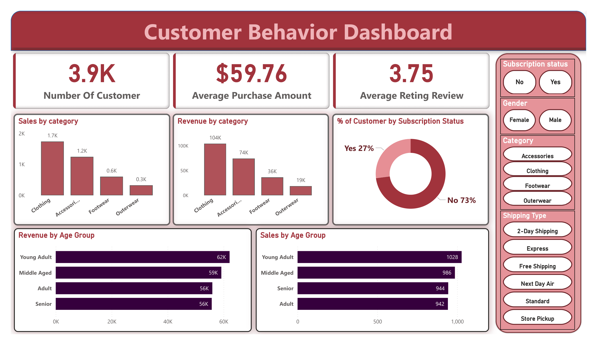

# Customer Behavior Analysis

## 📊 Project Overview

This project analyzes **customer shopping behavior** to identify purchasing patterns and business insights using **Python for data analysis** and **Power BI for interactive visualization**.

The goal of this project is to understand customer demographics, product preferences, and revenue patterns to help businesses make **data-driven decisions**.

---

## 🛠 Tools & Technologies

* Python
* Pandas
* NumPy
* Matplotlib
* Seaborn
* Power BI
* Jupyter Notebook
* GitHub

---

## 📁 Dataset

The dataset contains customer shopping data including:

* Customer ID
* Age
* Gender
* Product Category
* Purchase Amount
* Review Rating
* Subscription Status
* Shipping Type

The dataset is used to analyze **customer purchasing behavior and revenue distribution**.

---

## 📈 Exploratory Data Analysis

EDA was performed using **Python (Pandas, Matplotlib, Seaborn)** to explore patterns in customer purchases.

Key analysis included:

* Customer distribution by age group
* Revenue by product category
* Sales by category
* Subscription status analysis
* Customer review rating analysis

---

## 📊 Dashboard

An interactive **Power BI dashboard** was created to visualize customer trends and business insights.

Dashboard features include:

* Total number of customers
* Average purchase amount
* Average review rating
* Revenue by category
* Sales by category
* Revenue by age group
* Subscription status distribution


---

## 🔍 Key Insights

* Clothing category generates the **highest revenue**.
* Young adults contribute the **largest share of sales**.
* **73% of customers are non-subscribers**, indicating a potential opportunity for subscription marketing.
* Average purchase value is approximately **$59.76**.

---

## 📂 Project Structure

```
Customer-Behavior-Analysis
│
├── data
│   └── customers.csv
├── notebooks
│   └── Customer_Shopping_Analysis.ipynb
├── dashboard
│   └── Customer_Dashboard.pbix
├── reports
│   └── Customer_Behavior_Analysis_Report.pdf
├── images
│   └── dashboard_preview.png
├── README.md
├── requirements.txt
└── .gitignore
```
---

## 🚀 Future Improvements

* Build predictive models for customer purchase behavior
* Perform customer segmentation
* Create advanced Power BI analytics

---

## 👨‍💻 Author

**Saket Kumar Dubey**
Aspiring Data Analyst
